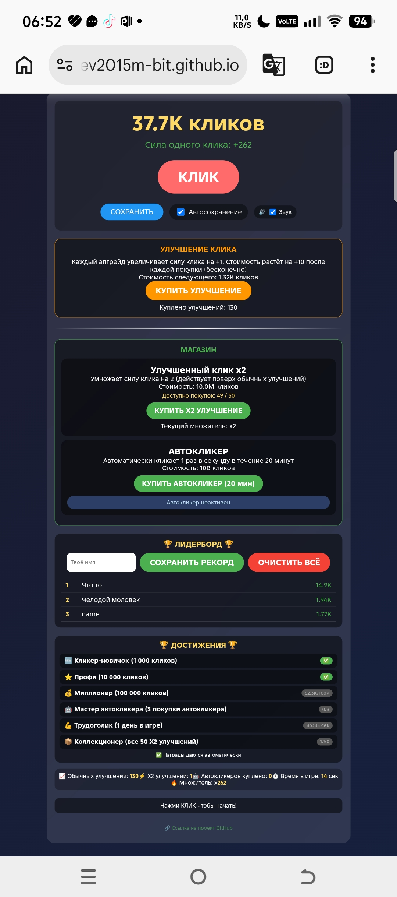

# Кликер - Игра с улучшениями и лидербордом

Простая кликер-игра, где ты кликаешь по кнопке, зарабатываешь клики, покупаешь улучшения и сохраняешь рекорды.

## 📸 Скриншот

  

## 🎮 Играть

[Кликни чтобы играть!](https://egorzuev2015m-bit.github.io/Clicked-for-HTML/)

## 🕹️ Механики

- Основной клик
- Улучшения
- Автокликер
- Достижения

## 🏆 Достижения

| Достижение | Условие | Награда |
|------------|---------|---------|
| 🆕 Кликер-новичок | 1 000 кликов | — |
| ⭐ Профи | 10 000 кликов | — |
| 💰 Миллионер | 100 000 кликов | +10 к силе |
| 🤖 Мастер автокликера | 3 покупки автокликера | — |
| 💪 Трудоголик | 1 день в игре | — |
| 📦 Коллекционер | 50 X2 улучшений | x10 к множителю |

## 🔊 Звук и анимация

- Анимация цифр при клике
- Звук с возможностью отключения

## 📊 Лидерборд

- Введи имя → нажми "Сохранить рекорд"
- Топ-15 твоих лучших результатов

## 💾 Сохранение

- Ручное сохранение
- Автосохранение каждые 10 секунд

---

🔗 [Ссылка на проект GitHub](https://egorzuev2015m-bit.github.io/Clicked-for-HTML/)

## 🚀 Как запустить локально

1. Скачай файл `index.html`
2. Открой его в любом браузере (Chrome, Firefox, Safari)
3. Играй без интернета

## 📝 История изменений

### v3.0 (текущая)
- ✨ Анимация всплывающих чисел при клике
- 🔊 Звук клика с возможностью отключения
- 🆕 Достижение «Кликер-новичок» (1000 кликов)
- ⭐ Достижение «Профи» (10 000 кликов)
- 🤖 Достижение «Мастер автокликера» (3 покупки)
- 💪 Достижение «Трудоголик» (1 день в игре)
- ⏱️ Счётчик времени в игре
- 📊 Счётчик купленных автокликеров

### v2.0
- Локальный лидерборд (сохранение рекордов)
- Автосохранение игры
- Достижения с наградами
- Форматирование крупных чисел
- Улучшение X2 (максимум 50 раз, дорожает на 10M)
- Автокликер на 20 минут

### v1.0
- Базовый кликер
- Обычные улучшения

## 📧 Контакты

Создатель: [egorzuev2015m-bit](https://github.com/egorzuev2015m-bit)
